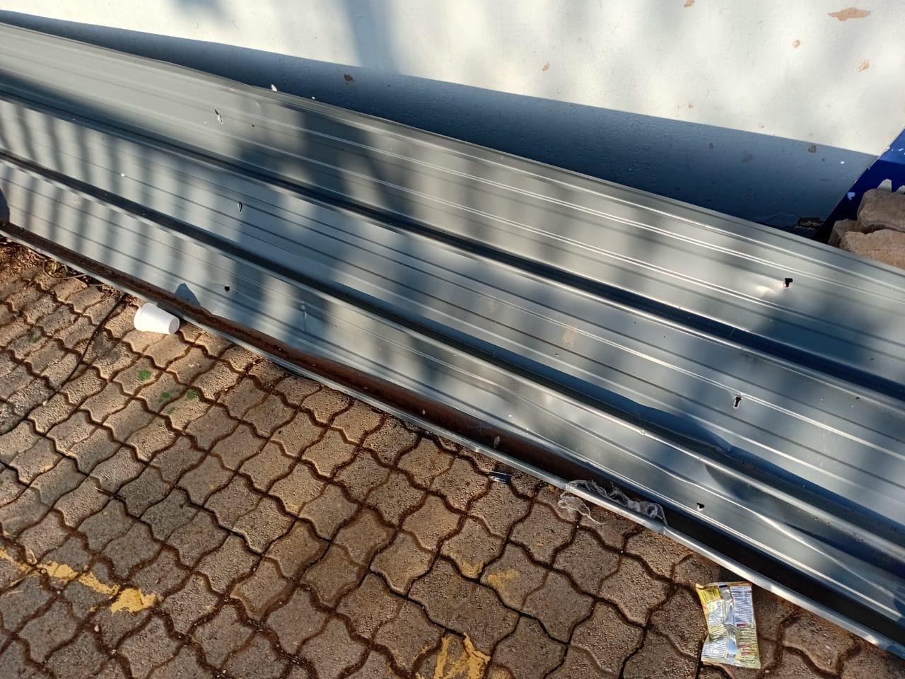

# 🏗️ Ndawonga Trading & Projects - Website Development

A comprehensive website development project for **Ndawonga Trading & Projects Co-Operative Limited**, a 100% Black-Owned, 51% Women-Owned civil engineering and construction company in South Africa.

## 🎯 Project Overview

This project delivers a complete web solution including:
- **Professional responsive website** with modern design
- **Comprehensive admin management system** for content control
- **Database-driven architecture** with secure authentication
- **Mobile-optimized interface** for all devices

## 👥 Development Team

- **Kgosi Olifant** - Lead Developer
- **Peter Matale Molepo** - Backend Developer  
- **Krival** - Frontend Developer
- **Sbongkwanda Simelane** - Database Administrator

## 🚀 Features

### 🌐 Frontend Website
- **Homepage** with company branding and hero section
- **Services Pages** showcasing civil engineering capabilities
- **Project Gallery** displaying completed works
- **Team Profiles** and company information
- **Contact System** with integrated forms
- **Client Logos Carousel** featuring major partners

### ⚙️ Admin Management System
- **Secure Authentication** with role-based access
- **Project Management** - Add, edit, delete projects
- **Team Management** - Manage team member profiles
- **Message Management** - Handle contact form submissions
- **User Registration** system for new admins
- **Dashboard Overview** with statistics

### 🔧 Technical Stack
- **Frontend:** HTML5, CSS3, JavaScript, Bootstrap
- **Backend:** PHP 8.0+
- **Database:** MySQL/MariaDB
- **Security:** Session management, password hashing
- **Design:** Responsive, mobile-first approach

## 📋 Installation & Setup

### Prerequisites
- **XAMPP/WAMP** or similar local server environment
- **PHP 8.0+**
- **MySQL/MariaDB**
- **Web browser** (Chrome, Firefox, Safari, Edge)

### Quick Setup
1. **Clone the repository**
   ```bash
   git clone https://github.com/yourusername/ndawonga-website.git
   cd ndawonga-website
   ```

2. **Database Setup**
   ```bash
   # Run the setup script
   php setup_admin_simple.php
   ```

3. **Access the Website**
   - **Main Website:** `http://localhost/ndawonga-website/`
   - **Admin Panel:** `http://localhost/ndawonga-website/admin/login.php`

### Admin Credentials
- **Username:** `admin` or `superadmin`
- **Email:** `admin@ndawonga.co.za`
- **Password:** `Admin123`

## 🎨 Screenshots

### Homepage


### Admin Dashboard
Professional admin interface for content management

### Project Gallery
Showcase of completed civil engineering projects

## 🏢 About Ndawonga Trading & Projects

- **100% Black-Owned** Civil Engineering & Construction Company
- **51% Women-Owned** - Empowerment Focused
- **Level 1 B-BBEE Certified** - Premium Status
- **CIDB Registered** - Grade 5CE & 4ME
- **15+ Years Experience** in Infrastructure Development

### Core Services
- 🛣️ **Civil Engineering** - Road construction, earthworks, infrastructure
- 🏗️ **Construction** - Building projects, residential & commercial
- ♻️ **Waste Management** - Comprehensive waste solutions
- 📋 **Project Management** - End-to-end project coordination

### Major Clients
- City of Johannesburg
- Gauteng Province
- Department of Public Works
- Ekurhuleni Metro
- Transnet
- Eskom
- SANRAL
- Water Affairs

## 📊 Project Statistics

- ✅ **100%** Project Completion
- 🎯 **8** Major Features Implemented
- 🚫 **0** Critical Issues
- 📱 **100%** Mobile Responsive
- 🔒 **Secure** Authentication System

## 🎯 Key Achievements

### Business Impact
- **Professional Online Presence** - Modern website showcasing capabilities
- **Improved Client Communication** - Streamlined contact and inquiry system
- **Enhanced Visibility** - SEO-optimized for better search rankings
- **Scalable Architecture** - Ready for future growth and expansion

### Technical Excellence
- **Responsive Design** - Works perfectly on all devices
- **Secure Backend** - Proper authentication and data protection
- **Clean Code** - Well-structured, maintainable codebase
- **Database Integration** - Efficient data management system

## 📁 Project Structure

```
ndawonga-website/
├── admin/                  # Admin panel files
│   ├── login.php          # Admin login page
│   ├── dashboard.php      # Admin dashboard
│   ├── projects.php       # Project management
│   ├── team.php           # Team management
│   ├── messages.php       # Message management
│   └── register.php       # User registration
├── assets/                # Static assets
│   ├── css/               # Stylesheets
│   ├── js/                # JavaScript files
│   └── images/            # Images and logos
├── includes/              # PHP includes
│   ├── header.php         # Site header
│   ├── footer.php         # Site footer
│   ├── auth.php           # Authentication class
│   └── database.php       # Database connection
├── index.php              # Homepage
├── about.php              # About page
├── services.php           # Services page
├── contact.php            # Contact page
├── team.php               # Team page
├── config.php             # Configuration file
├── presentation.html      # Project presentation
└── README.md              # This file
```

## 🔧 Configuration

### Database Configuration
Edit `config.php` to match your database settings:

```php
define('DB_HOST', 'localhost');
define('DB_NAME', 'ndawonga_db');
define('DB_USER', 'root');
define('DB_PASS', '');
```

### Site Configuration
```php
define('SITE_URL', 'http://localhost/ndawonga-website');
define('SITE_NAME', 'Ndawonga Trading and Projects Co-Operative Limited');
```

## 🎥 Presentation

A comprehensive 30-minute presentation is included in `presentation.html` covering:
1. **Business Background** - Company overview and services
2. **Problem Analysis** - Challenges faced without web presence
3. **Solution Design** - Technical approach and features
4. **System Demonstration** - Live demo of website and admin panel
5. **Project Outcomes** - Results and business impact

## 🤝 Contributing

This project was developed as part of an academic assignment. For any questions or suggestions:

- **Kgosi Olifant** - Lead Developer
- **Peter Matale Molepo** - Backend Developer
- **Krival** - Frontend Developer
- **Sbongkwanda Simelane** - Database Administrator

## 📄 License

This project is developed for **Ndawonga Trading & Projects Co-Operative Limited**. All rights reserved.

## 🎉 Project Status

**✅ COMPLETED** - All features implemented and tested successfully. The system is ready for production use with complete functionality for both public users and administrators.

---

**Built with ❤️ by the Development Team**  
*Professional Civil Engineering Website Solution*